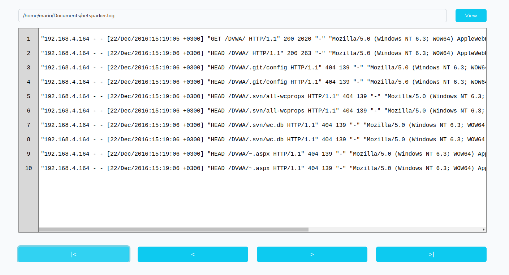

<!-- PROJECT HEADER -->
<br />
<div align="center">
  <h3 align="center">Laravel 9 - Log Viewer</h3>

  <p align="center">
    <a href="https://github.com/mario237/log-viewer.git">
      
    </a>
  </p>
</div>


<div align="center">
    <h3>Screenshot</h3>
     <a href="https://github.com/mario237/log-viewer.git">
      
    </a>

</div>


<!-- ABOUT THE PROJECT -->
## 1. About The Project

This a Laravel 9 App for Log Viewer which can view content of log file with specific path in lines


<!-- GETTING STARTED -->
## 2. Getting Started

This is an example of how you may be setting up your project locally.
To get a local copy up and running follow these simple example steps.

### Prerequisites

The following tools and services need to be installed on your development or production enviroment.
If these tools or services aren't installed yet, please follow the install guides of the tools or services itself.

***Required***
* git [download](https://git-scm.com/downloads)
* nodejs 14.17+ [download](https://nodejs.org/en/downloads)
* php 8.x [download](https://php.net/downloads.php)
* composer 2.2+ [download](http://getcomposer.org/dpownload)

***Optional***
* HTTP server with PHP support (e.g.: Apache, Nginx, Caddy)


### Installation

1. Clone the repo
   ```sh
   git clone https://github.com/mario237/log-viewer.git
   ```
2. Change to the working directory
   ```sh
   cd log-viewer
   ```
3. Install Composer packages
   ```sh
   composer install
   ```

4. Install NPM packages
   ```sh
   npm install
   ```

5. Copy the example enviroment variables
   ```sh
   cp .env.example .env
   ```
   

6. Generate the application key in `.env`
   ```sh
   php artisan key:generate
   ```
7. Build and run vite dependencies
   ```sh
   vite build
   ```


<!-- USAGE EXAMPLES -->
## 3. Usage

After the installation you may configure your webserver to serve the `public` folder or launch
the localhost server (example below) and visit the page on [localhost:8000](http://127.0.0.1:8000).
```sh
php artisan serve
```


